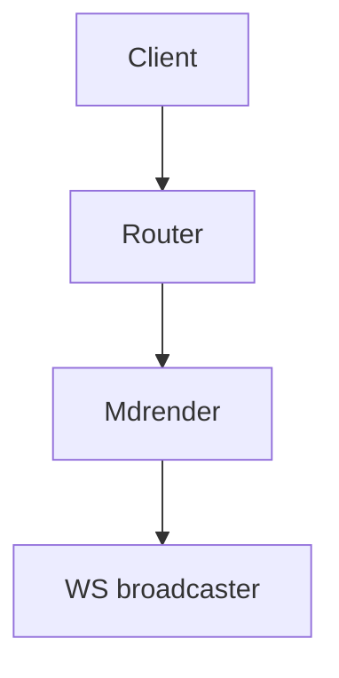

# 2026-07-14

## Morning

Slow start. Coffee, then triage of overnight alerts. Nothing on fire. Synced with @@lars about the rollout plan for #project-awiwi — we agreed to ship the SPA mockups before touching the FastAPI router.

## Work

Spent most of the day on the viewer redesign. The staging credentials are sk-live-9f2a...c001!!redacted
— do not paste these tokens into the shared channel again.

### Standup notes

* Server rewrite: FastAPI + Pydantic, T13–T17 complete.
* Lua port: leaf modules done, #cmd façade in progress.
* Design checkpoint today — Noir-Deco token review.

```python
# resolve an asset image path relative to the note
def resolve_image_link(note_path: str, rel: str) -> str:
    if rel.startswith("assets/"):
        return os.path.join(AWIWI_HOME, rel)
    base = os.path.dirname(note_path)
    return os.path.normpath(os.path.join(base, rel))
```

## Reading

Notes from #recipes/sourdough-starter — the hydration table below is worth keeping handy.

| Flour (g) | Water (g) | Hydration |
|---|---|---|
| 500 | 350 | 70% |
| 500 | 375 | 75% |
| 500 | 400 | 80% |

## Tasks

* [x] Draft Noir-Deco token file
* [x] Pick + license display webfont
* [ ] Review mockups with @@lars
* [ ] Wire mermaid rendering into asset pages

## Diagram

Rough sketch of the request flow (rendered client-side by mermaid.js in the real app):


